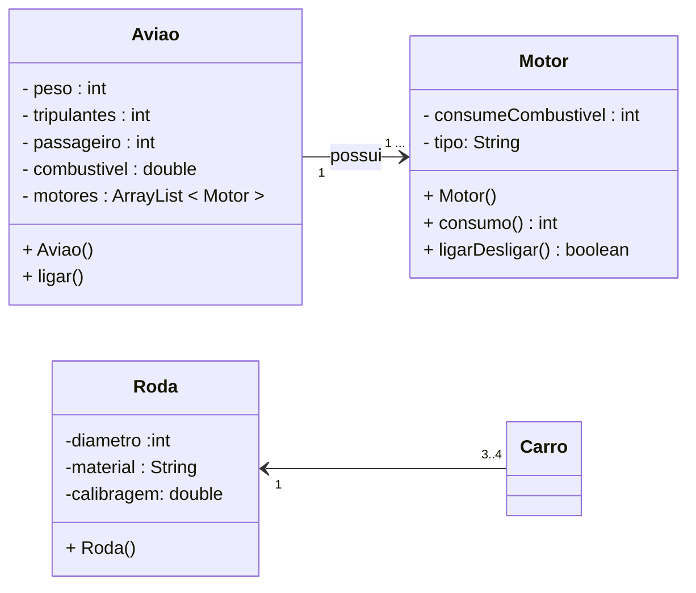
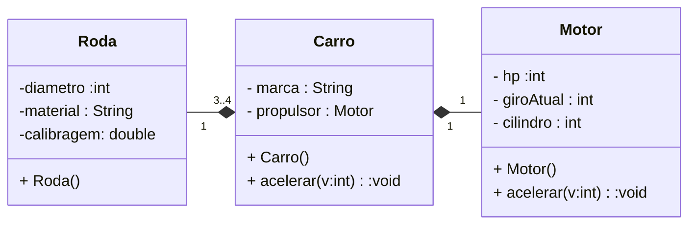
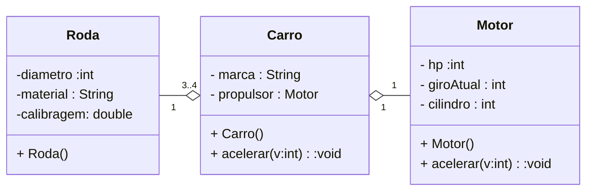

```mermaid
classDiagram
    direction LR
  
    class Aviao{
   - peso : int
   - tripulantes : int
   - passageiro : int
   - combustivel : double
   - motores : ArrayList ~ Motor ~ 

   + Aviao()
   + ligar()
   }

    class Motor{
    - consumeCombustivel : int
    - tipo: String
    + Motor()
    + consumo() int
    + ligarDesligar() boolean
    }
    Aviao "1"-->"1 ... 8"  Motor :  possui

    class Roda{
        -diametro :int
        -material : String
        -calibragem: double
        + Roda()
    }
    Roda "1"<--"3..4"  Carro
    
```

```mermaid
classDiagram
    direction LR
  
    class Carro{
    - marca : String
    - propulsor : Motor
    + Carro()
    + acelerar(v:int):void
    }

    class Motor{
    - hp :int
    - giroAtual : int
    - cilindro : int
    + Motor()
    + acelerar(v:int):void
    }
    Carro "1"*--"1"  Motor 

    class Roda{
        -diametro :int
        -material : String
        -calibragem: double
        + Roda()
    }
    Roda "1"--*"3..4"  Carro
    
```

```mermaid
classDiagram
    direction LR
  
    class Carro{
    - marca : String
    - propulsor : Motor
    + Carro()
    + acelerar(v:int):void
    }

    class Motor{
    - hp :int
    - giroAtual : int
    - cilindro : int
    + Motor()
    + acelerar(v:int):void
    }
    Carro "1"o--"1"  Motor 

    class Roda{
        -diametro :int
        -material : String
        -calibragem: double
        + Roda()
    }
    Roda "1"--o"3..4"  Carro
    
```